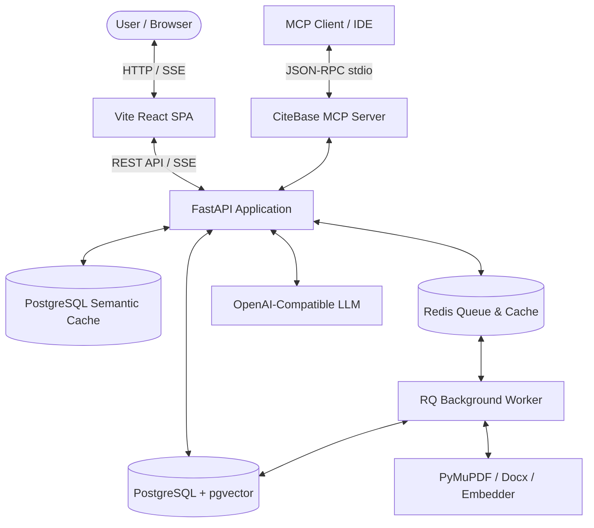
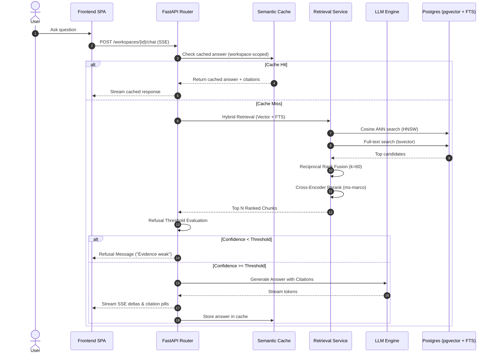

# CiteBase Pro — Architecture Specification

## Overview

CiteBase Pro is an enterprise Retrieval-Augmented Generation (RAG) platform that provides strictly grounded answers derived exclusively from workspace-owned documents, featuring verifiable citations, multi-tenant isolation, agentic query retry, and rigorous evaluation benchmarking.

---

## 🏗️ System Architecture

---

## 🔄 Retrieval & Generation Flow

---

## 🧱 Key Components

| Component | Technology | Role |
|---|---|---|
| **Backend API** | FastAPI, Python 3.10+ | Authentication, workspace tenancy, streaming SSE endpoints, telemetry |
| **Database** | PostgreSQL 16 + pgvector | Chunk embeddings (384-dim), full-text search (GIN tsvector trigger), ORM models |
| **Worker Queue** | Redis + RQ | Asynchronous document ingestion, OCR/scanned PDF detection, eval benchmark runs |
| **Embedding Engine** | sentence-transformers | `bge-small-en-v1.5` / `all-MiniLM-L6-v2` dense vector representations |
| **Reranker** | CrossEncoder | `ms-marco-MiniLM-L-6-v2` precision candidate reranking |
| **Frontend** | React 19, TypeScript, Vite | Modern glassmorphic dark UI, streaming chat, inline citation tags, slide-out inspector |
| **MCP Server** | Python stdio JSON-RPC | Model Context Protocol tools for Cursor, Claude Desktop, and AI agents |
